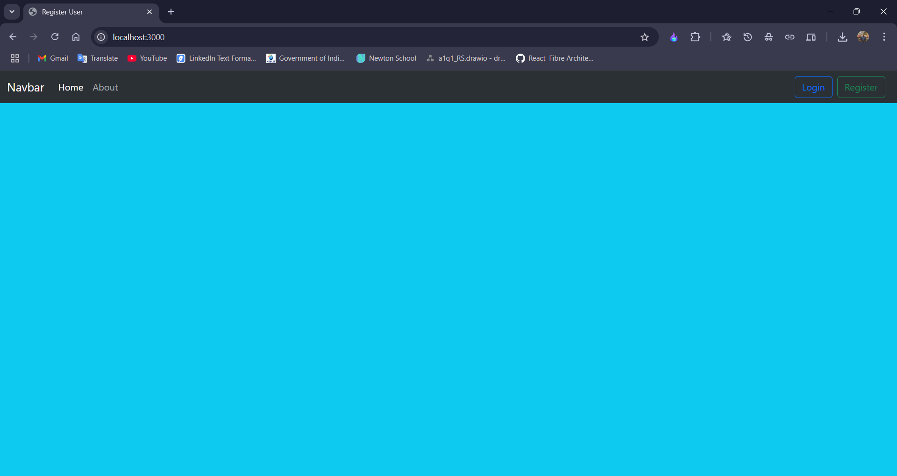
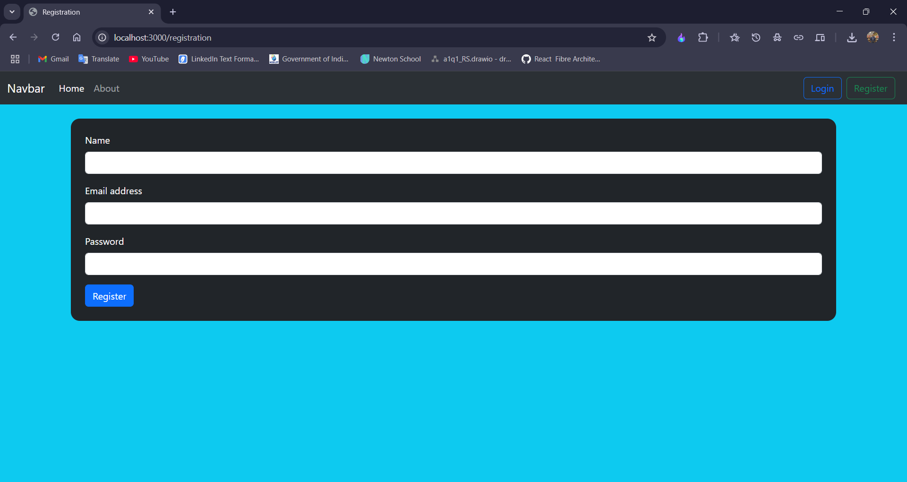
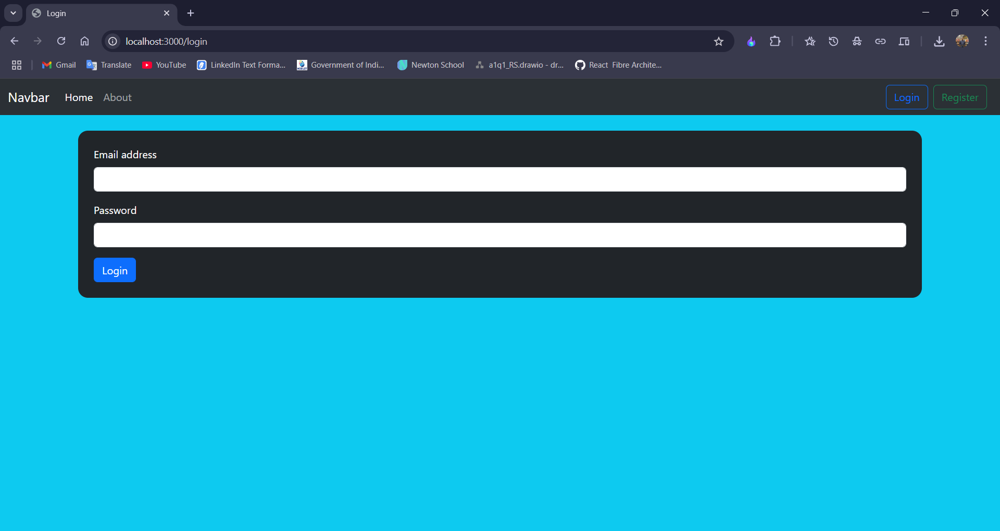
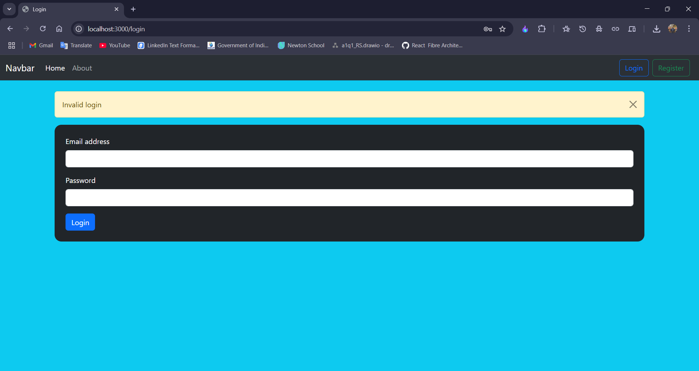
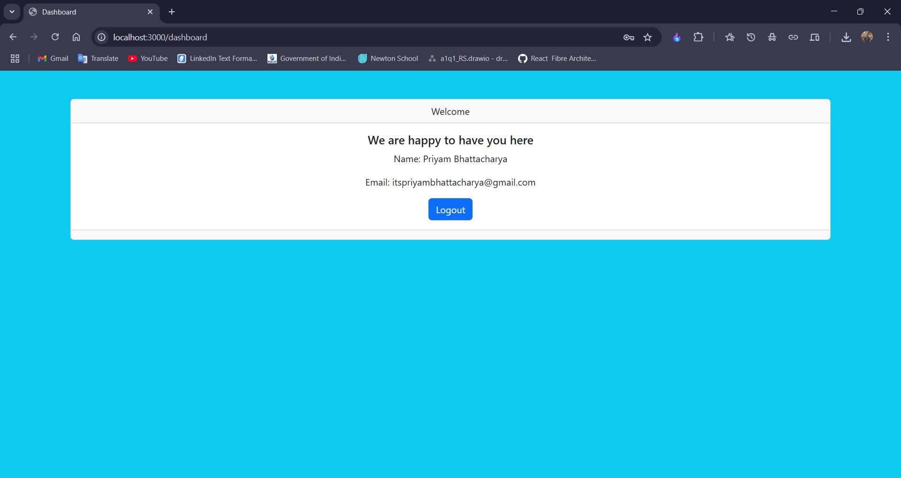

# 🛡️ User Authentication System using Express.js

This project is a fully functional **User Authentication System** built with **Express.js**, demonstrating user registration, login, session management, flash messaging, and authenticated dashboard access. It follows modular coding practices and uses a **MySQL database** for data persistence.

> 📌 **Tech Stack**: Node.js, Express.js, EJS, MySQL, Express-session, Connect-flash

---

## 📂 Project Structure

```
.
├── app.js                 # Main application entry point
├── db.js                  # MySQL database connection pool
├── routes/
│   ├── index.js           # Renders the home page
│   ├── registration.js    # User registration route
│   ├── login.js           # User login route
│   └── dashboard.js       # Protected dashboard route
├── views/
    ├── index.ejs
│   ├── registration.ejs
│   ├── login.ejs
│   └── dashboard.ejs
└── public/                # Static assets (CSS, images, JS)
```

---

## 🚀 Features

- 🔐 **Secure Registration & Login**
- 🔒 **Session-based Authentication**
- ⚠️ **Flash Messaging** for error handling
- 📄 **EJS Templating Engine**
- 🧩 **Modular Route Management**
- ✅ **Parameterized SQL Queries** to prevent SQL Injection
- 🧠 **Middleware Usage** for authentication checks

---

## 🛠 Prerequisites

Make sure you have the following installed:

- **Node.js** (v14 or later)
- **MySQL Server**

---

## 📦 Installation Steps

1. **Clone the Repository**

```bash
git clone https://github.com/itspriyambhattacharya/express_account_creation_and_session_handling
cd express_account_creation_and_session_handling
```

2. **Install Dependencies**

```bash
npm install
```

3. **Configure MySQL Database**

Run the following SQL script to set up your `user_auth` database:

```sql
CREATE DATABASE IF NOT EXISTS user_auth;

USE user_auth;

CREATE TABLE users (
    id INT AUTO_INCREMENT PRIMARY KEY,
    uname VARCHAR(50) NOT NULL,
    uemail VARCHAR(50) NOT NULL UNIQUE,
    upass VARCHAR(50) NOT NULL
);
```

Update `db.js` if your MySQL credentials are different:

```js
const pool = mysql2.createPool({
  host: "localhost",
  port: 3306,
  user: "root",
  password: "", // Change this as needed
  database: "user_auth",
  connectionLimit: 10,
});
```

4. **Run the Application**

```bash
node app.js
```

Navigate to `http://localhost:3000` to view the application.

---

## 🖥️ Available Routes

| Method | Route           | Description                            |
| ------ | --------------- | -------------------------------------- |
| GET    | `/`             | Home page (index)                      |
| GET    | `/registration` | User registration form                 |
| POST   | `/registration` | Register new user                      |
| GET    | `/login`        | Login form with flash message          |
| POST   | `/login`        | Authenticate user and start session    |
| GET    | `/dashboard`    | Protected dashboard (session required) |
| GET    | `/logout`       | Logout and destroy session             |

---

## 🧪 Screenshots

### 🏠 Home Page



---

### 📝 Registration Page



---

### 🔐 Login Page



---

### ⚠️ Invalid Login Flash Message



---

### 📊 Dashboard Page



---

## 🔐 Security Notes

- User passwords are stored in plaintext in this demo for educational purposes. **In a production environment**, always use a secure hashing library like `bcrypt`.
- Parameterized queries have been used to prevent SQL injection.
- Use `.env` to store secrets like session keys and database credentials in production.

---

## 🤝 Contributing

If you want to contribute to this project:

1. Fork the repository
2. Create a new branch: `git checkout -b feature-name`
3. Commit your changes: `git commit -m "Added new feature"`
4. Push to your branch: `git push origin feature-name`
5. Open a Pull Request

---

## 🧑‍💻 Author

**Priyam Bhattacharya**  
M.Sc. Computer Science, University of Calcutta  
GitHub: [itspriyambhattacharya](https://github.com/itspriyambhattacharya)

---

## 📃 License

This project is licensed under the MIT License. See the [LICENSE](LICENSE) file for details.

---
